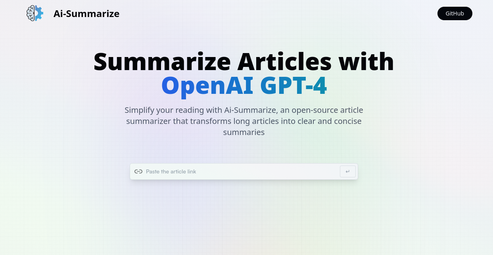

# Ai-Summarize - Simplify Your Reading with GPT-4

<p align="center">
  
  <br />
</p>

Ai-Summarize is a powerful open-source SaaS (Software as a Service) built to simplify your reading experience by transforming long articles into clear and concise summaries. Powered by GPT-4, the latest iteration of the cutting-edge language model from OpenAI, Ai-Summarize is your go-to tool for quickly extracting the most essential information from lengthy texts.

## Features

- **Effortless Summarization**: Ai-Summarize can analyze and summarize articles, research papers, blog posts, and more, so you can get to the main points without having to read every word.

- **React and Vite**: This project is built using the latest web technologies, including React for the user interface and Vite for a blazing-fast development experience.

- **TailwindCSS**: We've used TailwindCSS for rapid and highly customizable styling. You can easily tweak the look and feel to match your preferences.

- **Redux**: Manage the application state effectively with Redux, ensuring a seamless user experience while summarizing articles.

- **GPT-4 Integration**: Our integration with GPT-4 ensures high-quality summaries that capture the essence of the original content.

## How it Works

1. **Input Article URL**: Simply provide the URL of the article you want to summarize.

2. **GPT-4 Summarization**: Ai-Summarize will use the power of GPT-4 to analyze the article and generate a concise summary.

3. **Read or Save**: You can either read the summary on the platform or save it for future reference.

## Installation and Setup

To run Ai-Summarize on your local machine, follow these steps:

1. Clone this repository:
   ```bash
   git clone https://github.com/yourusername/Ai-Summarize.git

2. Navigate to the project directory:
   ```bash
   cd summarize

3. Install the required dependencies:
   ```bash
   npm install

4. Start the development server:
   ```bash
   npm run dev

5. Open your browser and visit http://localhost:5173 to access Ai-Summarize.